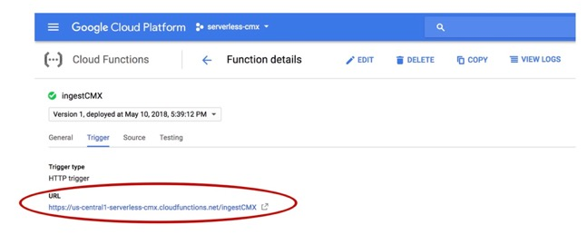
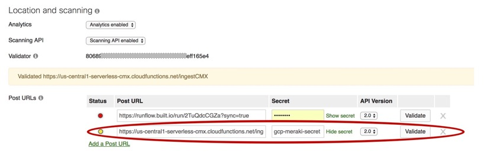
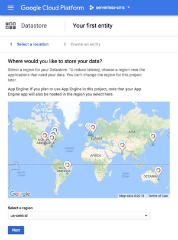
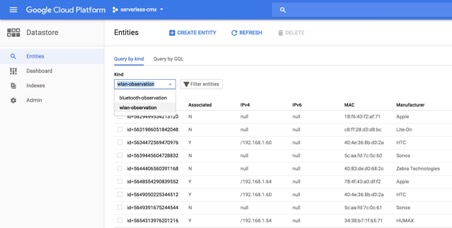
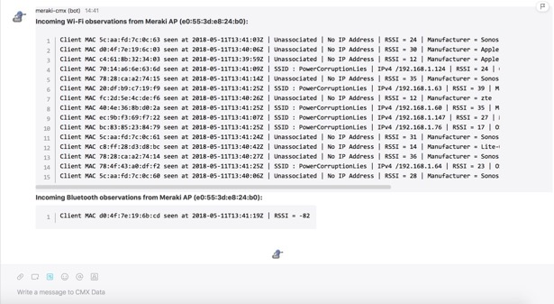
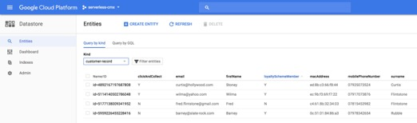

# Serverless CMX

_Know when your customer arrives in store. Uses the Meraki Scanning API to trigger an event-driven serverless application to detect customer arrival and notify store associates._

---
Demonstration to show what's possible when network infrastructure is connected to the Cloud. Code examples show how wireless presence data might be used in a Retail context without the hassle of setting up servers or running temporary local scripts connected to the web via ngrok.    

## Features

* Persistence - this demo doesn't stop when you close your laptop.  
* Built on a serverless platform using event-based microservices to make deployment easy, extensible and scalable.

## Solution Components

1. **Meraki:** Ingests mobile device presence data from a Meraki wireless network.
2. **Webex Teams:** Posts the Meraki presence data in human readable form in Webex Teams Room for real-time inspection. Upon identification of devices and associated "customers", messages are posted in a Webex Team room to inform retail staff about customers in store - e.g. arrival for a click-and-collect pick-up.
3. **GCP Cloud Functions and Pub/Sub:** Uses cloud hosted serverless functions to process presence events and pass messages between services. The application is written in JavaScript and executes on Node.js. All the code is contained in index.js as separate exported functions. The packages.json file lists the NPM module dependencies required by GCP for the functions.
4. **GCP Cloud Datastore:** Stores presence data and acts as a dummy CRM.


**NOTE:** Design criteria - use only GCP Always Free components. Google Cloud Functions (2M invocations/month), Cloud Pub/Sub (10 GB/month) and Cloud Datastore (1GB/day).
https://cloud.google.com/free/docs/always-free-usage-limits


## Cisco Products

* Meraki Wireless
* Webex Teams

## Usage

Connect a small Meraki wireless network to this Serverless application, invite a bot to your Webex Teams Rooms and you'll be notified when "customers" arrive "in-store".

## Installation

There are two parts to this, this first of which can be ignored if you are already set-up as a Webex Teams Developer and on GCP and want to get straight to the app. Of course, you must also have a small Meraki wireless network to play with. The second part just deploys the Cloud Functions in a GCP Project.

Start by cloning this repo:
```
git clone https://github.com/CiscoSE/serverless-cmx.git
```
Open index.js in an editor and be prepared to paste in 6 pieces of information as you go:

* **projectId** - e.g. "serverless-meraki-proj". This is the GCP Project name you have chosen.
* **validator** - e.g. "99689c856e34a80e8887e0d5d0206dcfeff445e4". The validator string to pass back to Meraki to confirm the API POST URL obtained from the Meraki dashboard.
* **secret** - e.g. "gcp-meraki-secret". Choose an arbitrary secret that Meraki will pass back to the serverless app for verification.
* **merakiCmxBotToken** - e.g. 'NTNkMDY4NzEtMDQ3Ya00ZTM5LTk5NGUtNTRlQDE3ZTYxODI4NTRmZDAyNDAtNDcy'. This is te "Meraki Bot" Webex Teams token.
* **cmxDataRoomID** - e.g.  'Z2lzY29zcGFyazovL3VzL1JPT01vMmExMTJkODAtOTc5Yy0xMWU2LThkNGEtOWI6ODc0ZjljNWE0'. This is the Webex Teams Room ID to write human-readable CMX data to.
* **customerActionRoomID** - e.g. 'Z2lzY29zcGFyazovL3WzL1JPT00vMTc1YjllMTAtNTkxZi0xMWU4LTg0ZTMtNzNjZTcwNmRmYjQ1'. This is the Webex Teams Room ID to write customer notifications to.


### Part 1 - Setup GCP, Webex Teams and Meraki

1. **GCP:** Sign-up for [Google Cloud Platform Free Tier](https://cloud.google.com/free/)
  *  Create a GCP Project following this [guide](https://cloud.google.com/resource-manager/docs/creating-managing-projects) e.g. "serveless-cmx"

  

  * Make a note of what you called your project and copy into index.js as the **projectId**
  * Download and install the [GCP SDK](https://cloud.google.com/sdk/) which includes the gcloud CLI tool needed to deploy the Cloud Functions.
  * Ensure that the gcloud beta components are installed as these are required to deploy Cloud Functions.
  ```
  gcloud components update
  gcloud components install beta
  ```
2. **Webex Teams:** Download and install the [Webex Teams](https://www.webex.com/products/teams/index.html) client. Sign-up for [Webex Teams Developer](https://developer.webex.com/index.html)
 * Create a Webex Teams bot following the [guide](https://developer.webex.com/bots.html)
 * Get the credentials (Bot ID) and copy into index.js as the **merakiCmxBotToken**
 * Create Webex Teams rooms:
    1. "CMX Data Dump" - where a Cloud Function will post formatted scanning API data
    1. "Store Operations" - where another Cloud Function will post messages for staff about customers
  * The Webex Teams Room IDs can be discovered using the [developer portal](https://developer.webex.com/endpoint-rooms-get.html) to List the details of the Rooms you have created.Turn on the Test Mode slide, press Run and copy the Room IDs into index.js.   
3. **Meraki:** Assuming you have Meraki AP and access to the Meraki Dashboard, then configure a Meraki API Post URI obtained from delpoying the **ingestCMX** function below. [Note: a single Meraki AP should easily keep compute and data resources comfortably under the always free thresholds]

### Part 2 - Deploy the Cloud Functions

1. Check the project has been created and set it to be the default project for gcloud if necessary (because you already have multiple projects). e.g.
   ```
   gcloud projects list
   gcloud config set project serverless-cmx
   ```
2. Create two GCP pubsub topics:
 * _scanning-api-post_
 * _customer-detected_

3. These are can be created manually from GCP Console or via CLI:
  ```javascript
    gcloud pubsub topics create scanning-api-post
    gcloud pubsub topics create customer-detected
  ```  
4. Manually enable the Pub/Sub API from the GCP Console as per [docs](https://cloud.google.com/pubsub/docs/quickstart-console)


5. The Pub/Sub topics will now be listed:


6. Enable the Cloud Functions API from the console


7. cd into your project _directory_
8. Deploy the ingestCMX Cloud Function via CLI. The functions will run in the default 256MB memory allocation which is adequate.
```
gcloud beta functions deploy ingestCMX --trigger-http
```
9. If the deploy is successful, you should see something like this:
```
Created .gcloudignore file. See `gcloud topic gcloudignore` for details.
Deploying function (may take a while - up to 2 minutes)...done.                                                                                  
availableMemoryMb: 128
entryPoint: ingestCMX
httpsTrigger:
  url: https://us-central1-serverless-cmx.cloudfunctions.net/ingestCMX
labels:
  deployment-tool: cli-gcloud
name: projects/serverless-cmx/locations/us-central1/functions/ingestCMX
...
status: ACTIVE
timeout: 60s
updateTime: '2018-05-10T16:39:12Z'
versionId: '1'
```
10. Make a note of the httpsTrigger URL - this is required as the target for the Meraki API to POST to. This will also be shown in the GCP console when the function finishes being deployed:


11. Click on the function name and then the Trigger section to confirm the trigger URL



12. Configure the Meraki API to point to the trigger URL. Login to Meraki dashboard, navigate to Network-Wide/Configure General and scroll down to the API section:



13. Ensure that the Scanning API is enabled and "Add a POST URL" with the correct trigger and the secret you have chosen. Press Validate button and save the changes.
14. Data from Meraki should now be flowing to the ingestCMX cloud function. You can verfiy this by observing the Cloud Function logs. The ingestCMX function should be triggered roughly every 30-60 secs a by Meraki API POST.
15. Before deploying the next function, writeCMXentity, it requires a valid Cloud Datastore database to exist ([Cloud Datastore overview]( https://cloud.google.com/datastore/docs/concepts/overview)).
 This is simply achieved by creating a Datastore associated with the project. Go to here to setup
 https://console.cloud.google.com/datastore/setup and click Next:



16. Deploy the writeCMXentity Cloud Function which subscribes to the _scanning-api-post_ topic and dumps the data
into Datastore
```
gcloud beta functions deploy writeCMXentity --trigger-topic=scanning-api-post
```
17. You can check this working by checking the logs for the writeCMXentity function and observe data being written to Datastore:



18. Deploy the writeCMXDataToWebexTeams function which subscribes to the scanning-api-post topic, formats the received CMX data in human readable format and posts as a Bot into a WT Space using the Webex Teams JavaScript SDK.
```
gcloud beta functions deploy writeCMXDataToWebexTeams --trigger-topic=scanning-api-post
```
19. You should see the bot posting messages in your Webex Teams room like this:



20. Deploy the customerDetect function
```
gcloud beta functions deploy customerDetect --trigger-topic=scanning-api-post
```
21. Create some customer-records in Cloud Datastore as a fake "CRM".
```
gcloud beta functions deploy initCRM --trigger-http
```
You should see some output like:
```
Deploying function (may take a while - up to 2 minutes)...done.                                                                                  
availableMemoryMb: 256
entryPoint: initCRM
httpsTrigger:
  url: https://us-central1-serverless-cmx.cloudfunctions.net/initCRM
labels:
  deployment-tool: cli-gcloud
name: projects/serverless-cmx/locations/us-central1/functions/initCRM
  ...
status: ACTIVE
timeout: 60s
updateTime: '2018-05-11T16:42:59Z'
versionId: '2'
```
22. Use a web browser to visit the trigger URL (e.g. https://us-central1-serverless-cmx.cloudfunctions.net/initCRM)
You should see a response in the browser of _"Customer CRM database initialised with some sample data"_
We only need to do this once to initialise some data. This is a bit clunky, but the easiest way to keep everything within the Cloud Functions domain.
23. Visit the Datastore console and check some initial data has been inserted:



24. Now manually edit or create some new customer-records with real MAC addresses of clients in your network. via the GCP Console [guide](https://cloud.google.com/datastore/docs/editing_entity_console)
25. Ensure that the **customerActionRoomID** is has the correct RoomID and your Bot has been invited to the space.
26. Deploy customerAction Cloud Function:
```
gcloud beta functions deploy customerAction --trigger-topic=customer-detected
```

## Finish

You should have end up with a couple of Webex Teams rooms - one full of data about the wireless and bluetooth clients being observed and the other updating about dummy "customers" coming into store to pick-up Click-and-Collect orders, etc. This is just a demo coupling infrastructure and collaboration tech with Serverless - hope it inspires something useful.

## Author

* Bob Garland - bogarlan@cisco.com

## Other Documentation

* Introduction to [GCP serverless](https://cloud.google.com/functions/)
* Deploying Cloud Functions by [CLI](https://cloud.google.com/sdk/gcloud/reference/beta/functions/deploy)
* Cloud Function [scalability](https://cloud.google.com/functions/quotas#scalability)

## To Do
*  Hash MAC addresses on ingest and in "CRM" for privacy.
*  Test on networks with multiple Access Points.
*  Collect location (x,y) / (lat,long) data and do something interesting with it
*  Bluetooth data is stored but ignored. Why bother?
*  Implement more useful customer actions - e.g. send an SMS (using Tropo) or a "Staff App" notification.
